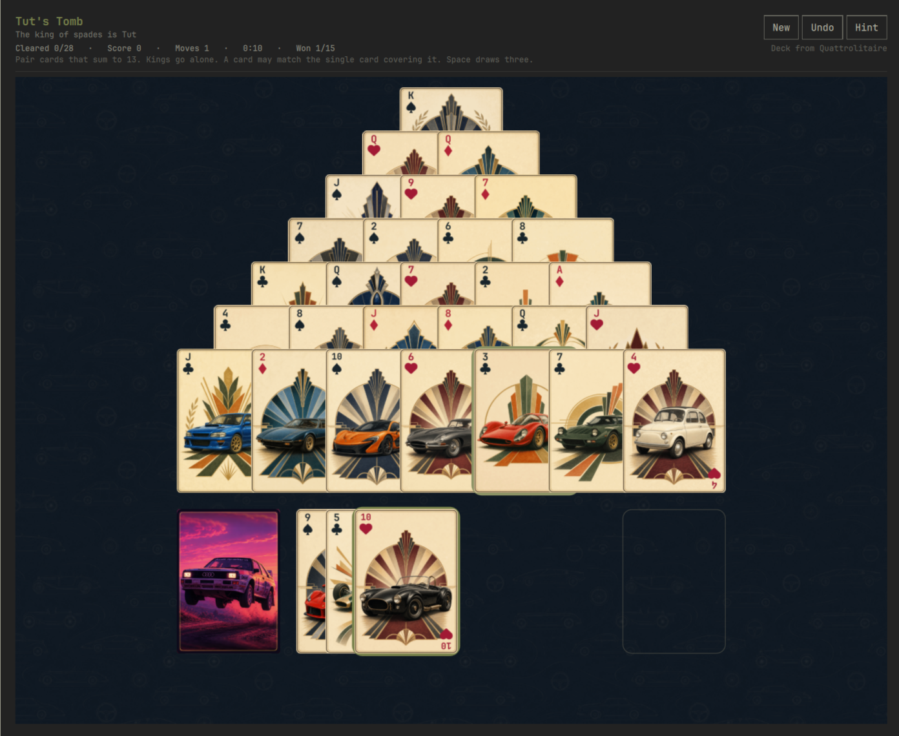

# Tut's Tomb



Pyramid solitaire for the [Omarchy](https://omarchy.org/) shell. Clear the
tomb by pairing cards that add up to 13. The king of spades is dealt face up
at the top of the pyramid: that card is Tut.

The deck is the art-deco car deck from
[Quattrolitaire](https://github.com/28allday/Quattrolitaire) by Gavin Nugent,
used under the MIT license and copied unchanged. Felt, outlines and chrome
take their colours from the active Omarchy theme, the same way that table does.
See [NOTICE.md](NOTICE.md) and [cards/CREDITS.md](cards/CREDITS.md).

## Install

```sh
omarchy plugin add https://github.com/TomFaulkner/omarchy-tuts-tomb.git --enable
```

From this checkout:

```sh
./install.sh
```

That symlinks the repo into `~/.config/omarchy/plugins/` and enables the bar
icon. Then click ▲, or:

```sh
omarchy-shell shell toggle io.github.tomfaulkner.tuts-tomb
```

A keybind, if you want one, in `~/.config/hypr/bindings.lua`:

```lua
o.bind("SUPER + CTRL + T", "Tut's Tomb", "omarchy-shell shell toggle io.github.tomfaulkner.tuts-tomb")
```

If the icon does not show up, restart the shell with `omarchy-restart-shell`.
QML is cached. After editing it, restart the shell. Do not run
`omarchy-refresh-shell`; that resets `shell.json`.

## How to play

One deck. The king of spades is placed first. 27 more cards complete a pyramid
of seven rows, and the remaining 24 are the stock.

- A pyramid card is free when both cards overlapping it have been removed.
  Only the bottom row starts free.
- Remove two free cards whose ranks sum to 13 (ace 1, jack 11, queen 12).
  Click one, then the other, or drag one onto the other.
- A king is 13. Click it to remove it on its own.
- A card covered by exactly one card can be removed together with that card,
  when the two sum to 13 and nothing else is sitting on the covering card.
- Space, or a click on the stock, draws three. Only the top waste card is
  playable. Playing it uncovers the one beneath.
- When the stock is empty, click it again (the ↻) to turn the waste face down
  and draw through it again. There is no redeal limit.
- You win when the pyramid is empty. Cards left in the stock do not matter.

Scoring is this table's, not a traditional one: +10 for each pyramid card
removed, +5 for each waste card removed, and a win bonus of 100 plus one point
for every second under three minutes.

## Controls

- Click a free card, then a card that makes 13. Click a king to take it.
- Drag a card onto its match.
- Click the stock, or Space / `D`, to draw three.
- `H` hint, `U` or `Z` undo, `N` new game, Esc close.

## Where things live

| Path | What |
| --- | --- |
| `manifest.json` | Panel + bar widget, `keepLoaded` |
| `Rules.js` | The patience. No QML types |
| `Panel.qml` | Table, drag, theme, save |
| `cards/` | Quattrolitaire's deck, unchanged |
| `~/.local/state/omarchy-tuts-tomb/state.json` | The game in progress and the win record |

The deal is written after each move. Closing the panel keeps the game. Closing
it after a win deals the next one. A saved file that is not a full unduplicated
deck is discarded and a fresh game is dealt.

Removing the plugin does not delete that file:

```sh
omarchy plugin disable io.github.tomfaulkner.tuts-tomb
omarchy plugin remove io.github.tomfaulkner.tuts-tomb --yes
rm -rf "${XDG_STATE_HOME:-$HOME/.local/state}/omarchy-tuts-tomb"
```

## Development

```sh
node --test
omarchy plugin validate .
```

`Rules.js` is plain JavaScript so the rules can be tested without the shell.
`module.exports` is guarded and ignored by QML.

## License

MIT. Quattrolitaire's copyright stays on the deck and on the portions of the
panel plumbing taken from that project. Tut's Tomb, the card game, is public
domain. See [LICENSE](LICENSE) and [NOTICE.md](NOTICE.md).
